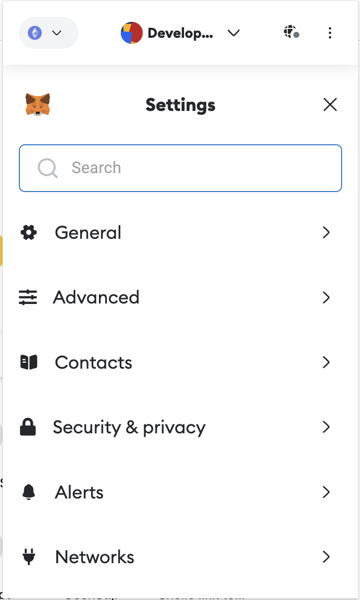
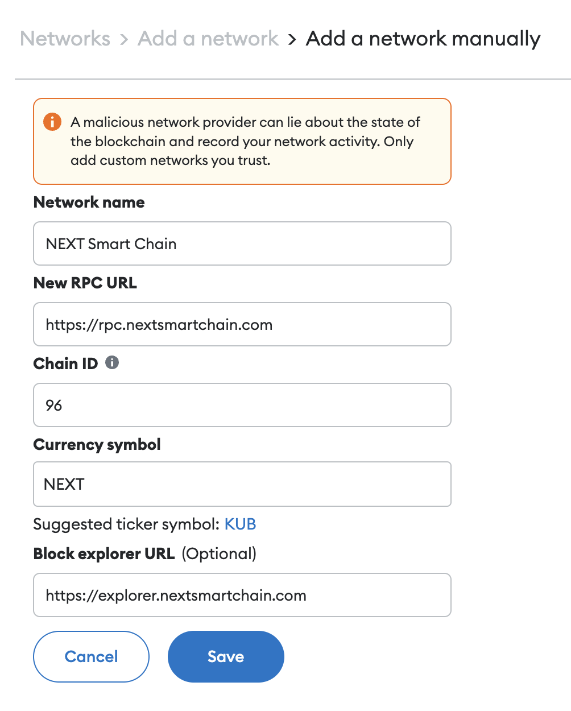

# Connect NEXT to MetaMask

## Install MetaMask

MetaMask can be downloaded on Chrome and Firefox, or on iOS and Android if you’re a mobile user. For the purposes of this tutorial, we’ll use the Firefox version, but the instructions will be more or less the same for every platform.

Firstly, you’ll want to head over to the [MetaMask Download page](https://metamask.io/download/). From there, select whichever platform you’re using, and follow the steps to install it on your device. Easy!

Next, follow along with the setup specified by the app. Go ahead and click Create a Wallet. Write down the backup seed phrase somewhere secret (preferably not on an Internet-connected device). Without this phrase, your funds can’t be recovered if your device is damaged or lost. Confirm that you’ve written them down on the next page.

**And that’s it! You should now see your wallet, ready to send and receive funds.**

## Configuring the wallet

You might notice straight away that we’re still dealing with an Ethereum wallet.
Let’s change that. We want to access the `Settings` to point the wallet towards Next Smart Chain nodes.

On the Settings page, we want to locate the `Networks` menu.

After clicking on `Networks`, click on `Add Network` which is below. This will redirect to the MetaMask website, click on `Add a network manually`. Fill in the following details in the form:

### Mainnet

| Network Name             | RPC URL                          | Chain ID | Symbol | Explorer URL                         |
| ------------------------ | -------------------------------- | -------- | ------ | ------------------------------------ |
| NEXT Smart Chain         | https://rpc.nextsmartchain.com/  | 96       | NEXT   | https://explorer.nextsmartchain.com  | 

### Testnet

| Network Name             | RPC URL                          | Chain ID | Symbol | Explorer URL                         |
| ------------------------ | -------------------------------- | -------- | ------ | ------------------------------------ |
| NEXT Smart Chain Testnet | https://testnet-rpc.nextsmartchain.com/  | 98       | tNEXT   | https://testnet-explorer.nextsmartchain.com  | 

Once you Save the Network and return to the main view, you’ll notice two things: the network has automatically been set to the one you just entered, and the units are no longer denominated in ETH, but in NEXT.